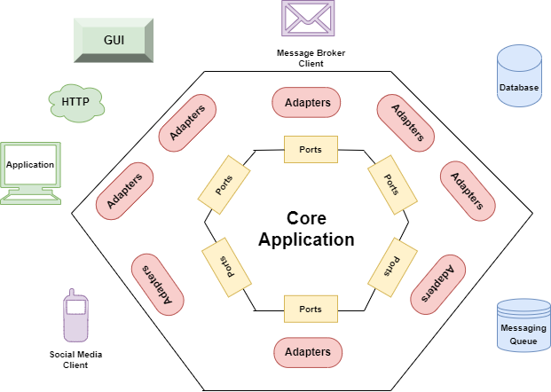
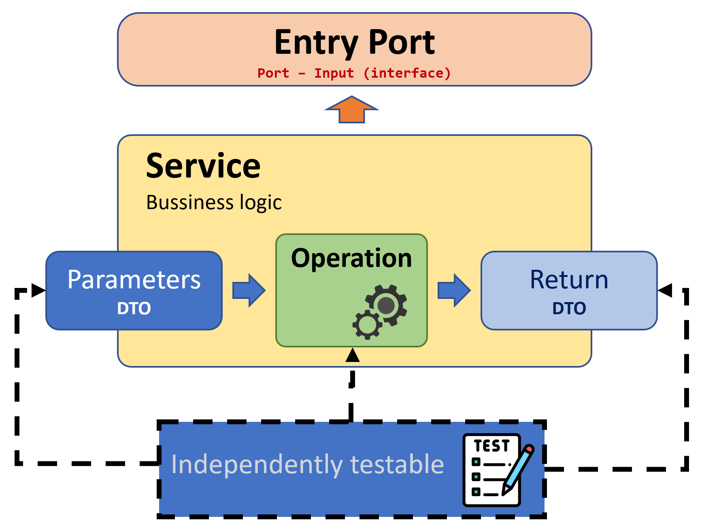
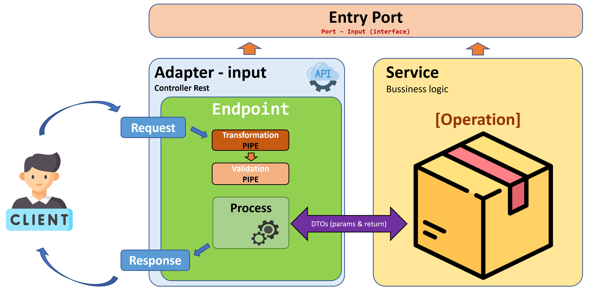
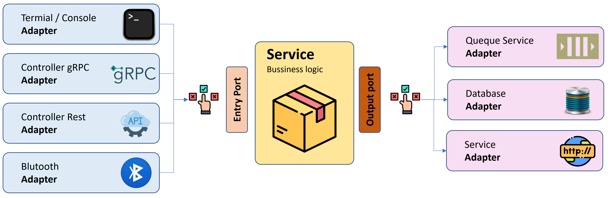

# Hexagonal Architecture


Original article by Alistar Cockburn (2005) (2005): [Read here](url:https://alistair.cockburn.us/hexagonal-architecture/ "Original article by Alistar Cockburn (2005)")

For those of us who have the pleasure (or the need) to program, it is our duty to ensure the maintainability and low complexity of our developments.

To achieve this, we need to rethink the way we work and adopt principles such as SOLID, DRY, and KISS. But it is also crucial to have an effective organization of our code to achieve the objectives of quality and efficiency in software development.

In the process of organizing our developments, it is important to separate the concerns and responsibilities of the system into different components or layers. It is essential that our business (core of our system) has no dependencies with the infrastructure it uses. To achieve this, it is important to abstract how we relate our logic to the infrastructure we will use.

Since Alan Turing wrote his first codes for a machine in 1946, we have evolved in how we approach software development. Examples of this are:

- Client-Server Architecture (~1960)
- Layered Architecture (~1970)
- Pipe and Filter Architecture (~1976)
- Model-View-Presenter (MVP) (~1979)
- Model-View-Controller (MVC) (~1990)

In recapitulating this, we can affirm that in the process of constructing software, it is essential that the systems are maintainable, scalable, flexible, and resistant to changes. A well-designed architecture can help achieve these objectives.

---

## What is Software Architecture?


Software architecture refers to the set of technical decisions and solutions that are made in the design and construction of a software system. This architecture defines the structure and organization of the system, as well as how its components interact and communicate with each other. Its main objective is to solve technical and business problems such as scalability, security, performance, maintainability, and ease of use of the system. It may also include decisions about technology, programming languages, development tools, and design patterns.

The decision about the architecture of a software system is also related to the purpose of the system, such as optimization for speed and efficiency or a focus on security and scalability. However, the most common approach is for the architecture to be an adaptation to the culture of the company or organization where it is being implemented.

When choosing an architecture, it should be noted that it should make the system easier to maintain, update, and scale, improving its ability to respond to changes in business requirements. In addition, the architecture can help reduce development costs and time, and improve the quality of the software produced. In summary, a well-designed software architecture is essential to achieve a solid, scalable, and easy-to-maintain software system.

> Architecture represents the relevant design decisions that shape a system, where the cost of change is measured.
>
> - Grady Booch

---

## What is Hexagonal Architecture?

Hexagonal Architecture is a way of organizing a software system into different layers, separating concerns and responsibilities of each layer. The central layer of the system is the core, which contains the business logic and domain rules. The outer layers are the adapters, which communicate the system with the outside world. Ports are the interfaces used to communicate the core with the outside world, while adapters are the concrete implementations of these interfaces.

It focuses on reducing the complexity of the system, reducing dependencies, and increasing the flexibility and scalability of the system.

By separating the business logic from the rest of the system, it makes the system easier to test, maintain, and change, as well as making it easier to adapt to changes in business requirements.

### Original diagram


> This diagram is the same as the one in Alistair Cockburn's original article, but it may not be very clear.

### Refined diagram



> This second diagram is a little clearer, as it shows how the core of our solution is isolated from the infrastructure and communicates through ports and adapters.

### Breaking down the architecture

The last diagram clearly showed the existence of primary and secondary ports and adapters, also known as Driving Adapters and Driven Adapters, respectively.

In simpler terms, we will have adapters and ports that will be inputs for our solution, and others that will be outputs. It is important to understand this difference in order to properly design our architecture and have better control over the flow of information in our system.

In summary, Hexagonal Architecture is based on the use of ports and adapters, which are classified as primary and secondary, allowing for a clear separation between the core of our solution and the infrastructure, improving the flexibility, scalability, and maintainability of our system.

A diagram that better illustrates this would be the following:


---

## Project structure

The structure of a project varies depending on the programming language used. In this article, we will consider a project for a service developed in [Node/Typescript] (however, for the purposes of this article, a more generic approach will be used).

> TLDR: the structure presented below is just a simple example of how to approach a hexagonal architecture, but there are many other ways to do it. Ideally, it should be tailored to the specific needs of the development being addressed.

In general, the project structure usually responds to one or more domains. In this case, we will focus on a specific structure for a domain, although we could also approach a simpler structure at the context or entity level. It is not necessary to be overly purist in this conceptualization, the important thing is to achieve the ultimate goal of an easy-to-maintain, update, and scale solution. The key is to maintain an organized and coherent structure that facilitates development and code maintainability.

```txt
+ api
  - app.ts
  - server.ts
  + src
    + domain_one
    + domain_two
    + domain_three
```

### 1.- Our business logic (Services)

To develop a software system, it is important to consider the business operations we want to cover. Whether we have an anemic model or an enriched one, we must list the specific operations, including the rules, conditions, and considerations that apply to the business. A good strategy at this point is to visualize the core as a service that offers a set of operations.

```txt
+ api
  - app.ts
  - server.ts
  + src
    + domain
      + (*) services
        - (*) domain-service.ts
```

### 2.- Input port (Ports-inputs)

It is important to remember that we are in the innermost layer of our architecture. Therefore, our service does not know who will consume it or where the information will be retrieved. If we look at the diagrams, we will see that our input service should respond to a port, considering our primary flow. Therefore, our core or service should implement a port. This leads us to understand that our input port is an interface.

```txt
+ api
  - app.ts
  - server.ts
  + src
    + domain
      + (*) ports
        + (*) inputs
          - (*) domain-port.ts
      + services
        - domain-service.ts
```

### 3.- Data for our inputs (Ports-inputs-dtos)

It is likely that the operations our service will implement require parameters and returns. To transfer data to and from our service, objects known as DTOs are used. It should be noted that these objects and the operations that use them as parameters and returns are unaware of who will use them, so they must be specifically limited to what they solve. At this point, the Dependency Inversion Principle (DIP) applies.

```txt
+ api
  - app.ts
  - server.ts
  + src
    + domain
      + ports
        + inputs
          + (*) dtos
            - (*) operation.one.params-dto.ts
            - (*) operation.one.return-dto.ts
          - domain-port.ts
      + services
        - domain-service.ts
```



> One of the advantages of approaching the solution in abstract layers is that we can test these components without the need to know the source or destination (infrastructure).

---

### 4.- Exposing our service (Adapters-inputs)

Once we have our service and its input port, it is logical to think about how our application (in this case an API) will make the operations available. If we consider that we are implementing a REST service, it would be appropriate to use a controller that exposes our operations as endpoints.

Given that data communication in a REST architecture is quite specific, it is natural to think that certain operations are required on our requests, such as transformations or validations. These operations can be conceptualized as "pipes" (referring to the "Pipe and Filter" concept).

```txt
+ api
  - app.ts
  - server.ts
  + src
    + domain
      + adapters
        + (*) inputs
          - (*) domain.rest-controllers.ts
        + (*) pipes
          - (*) domain.rest-transformations.ts
          - (*) domain.rest-validations.ts
      + ports
        + inputs
          + dtos
            - operation.one.params-dto.ts
            - operation.one.return-dto.ts
          - domain-port.ts
      + services
        - domain-service.ts
```

Each endpoint that we define in our controller should interpret the request and generate the appropriate response based on the service's response. However, the service implementation logic is something that the controller is not aware of; it only needs to know the service's input port. Like in the service, we will need to implement this port in the controller, and in each endpoint, we must call the corresponding operation being served.



> By isolating our controller from the logic that performs the operation, it becomes easier to perform tests on the endpoint, since we can comfortably simulate different service responses and thus cover the different scenarios of the endpoint.

---

### 5.- Implementation of the Service

So far, we have seen how our application exposes a REST service through a controller, which accesses different encapsulated operations in an independent layer. However, we have not yet determined how to store or retrieve information (for example), that is, how to handle the output of our solution.

Just like in the case of the input adapter, which in our example is a REST controller, if we want to perform operations with persistent information, such as a database, we will need an output adapter, such as a database repository. To implement this, we also need a port, in this case an output port.

At this point, it is important to ask ourselves if our service logic will always be consumed by the same input adapter and if we will always use the same output adapter. These adjustments are probably rare, but not impossible. The hexagonal architecture contemplates this possibility through the ports, which do not vary and allow the use of different adapters. A simple example could be:



While our solution could have multiple inputs and outputs simultaneously, it is normal to define one. However, depending on the stage in which our solution is, it is possible that during our development we do not have all the infrastructure, so some of our adapters, especially the output ones, will be test implementations. For these situations and perhaps if we contemplate a change without major costs in the future, we can use the software design pattern called Inversion of Control (IoC). This will give us an increase in flexibility and decoupling of the components in a system.

Keeping Inversion of Control in mind implies that at the beginning of our application we will create a container that will maintain the implementation of an output port that will contain the operations we require, this also implies that the implementation must be contained in an adapter and that we will need other DTOs in this layer, with these considerations, the structure of our application would be as follows:

```txt
+ api
  - app.ts
  - server.ts
  + src
    + (*) config (IoC)
    + domain
      + adapters
        + inputs
          - domain.rest-controllers.ts
        + (*) outputs
          - (*) domain-repository.ts
        + pipes
          - domain.rest-transformations.ts
          - domain.rest-validations.ts
      + ports
        + inputs
          + dtos
            - operation.one.params-dto.ts
            - operation.one.return-dto.ts
          - domain-port.ts
        + (*) outputs
          + (*) dtos
            - (*) call.one.params-dto.ts
            - (*) call.one.return-dto.ts
          - (*) domain.reposiroty-port.ts
      + services
        - domain-service.ts
```

---

## Recap and perspectives

The hexagonal architecture, like any other architecture, is not the universal solution for all solutions. It is important to keep in mind that it is a proposal that emerged in 2005 and was then refined with the onion architecture, described by Jeffery Palermo in 2008. Later, it was perfected in the clean architecture presented by Robert C. Martin in 2012. The latter has become one of the most popular and respected software design approaches in the industry. However, as mentioned, each problem can be approached with various solutions, with different levels of complexity and approaches.

The hexagonal architecture offers a simple way to approach maintainability and reduce the complexity of our developments. It ensures separation of responsibilities, promotes single responsibility, and properly controls dependencies. It also helps us create testable solutions, which is very useful when using TDD.

> If you think good architecture is expensive, try bad architecture.
>
> - Brian Foote y Joseph Yoder

---

**Article on Github**

- Spanish version [here](url:https://github.com/silverfox78/HexagonalArchitecture "Github.com")

**Article on Medium**

- Spanish version: [here](url:https://samuelbarrerabastidas.medium.com/arquitectura-hexagonal-62e6ae70d249 "Medium.com")

**Article on Dev**

- English version: [aquí](url:https://dev.to/sbarrera/hexagonal-architecture-1ml9 "Dev.to")