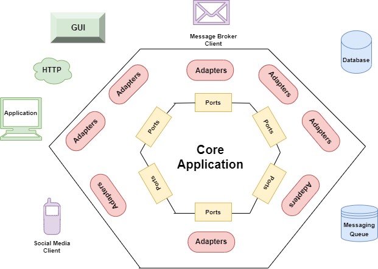
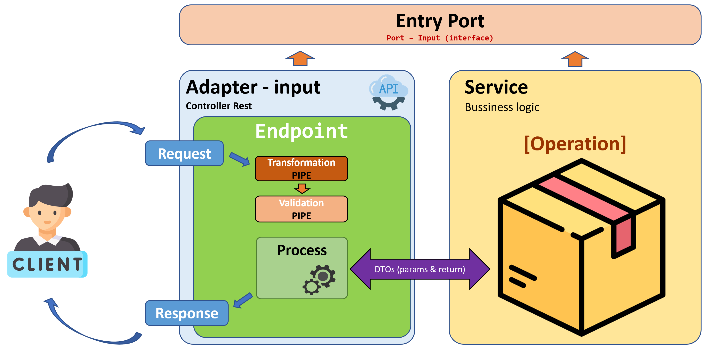
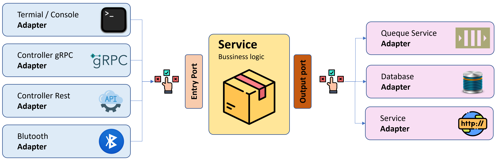

# Arquitectura Hexagonal


Articulo original de Alistar Cockburn (2005): [Leer aquí](url:https://alistair.cockburn.us/hexagonal-architecture/ "Articulo original de Alistar Cockburn")

Para aquellos que tenemos el gusto (o la necesidad) de programar, es nuestro deber asegurar la mantenibilidad y baja complejidad de nuestros desarrollos. 

Para lograr esto, necesitamos replantear la forma en que trabajamos y adoptar principios como SOLID, DRY y KISS. Pero además, es fundamental disponer de una organización efectiva de nuestro código para alcanzar los objetivos de calidad y eficiencia en el desarrollo de software.

En el proceso de organizar nuestros desarrollos, es importante separar las preocupaciones y responsabilidades del sistema en distintos componentes o capas. Es fundamental que nuestro negocio (núcleo de nuestro sistema) no tenga dependencias con la infraestructura que utiliza. Para lograr esto, es importante abstractizar cómo relacionamos nuestra lógica con la infraestructura que usaremos.

Desde que Alan Turing escribió sus primeros códigos para una máquina en 1946, hemos evolucionado en cómo afrontamos el desarrollo de software. Ejemplos de ello son:

- Arquitectura cliente-servidor (Client-Server Architecture) (~1960)
- Arquitectura basada en capas (Layered Architecture) (~1970)
- Arquitectura de tuberías y filtros (Pipe and Filter Architecture) (~1976)
- Patrón de diseño Modelo-Vista-Presentador (Model-View-Presenter - MVP) (~1979)
- Patrón de diseño Modelo-Vista-Controlador (Model-View-Controller - MVC) (~1990)

Al recapitular esto, podemos afirmar que en el proceso de construcción de software, es fundamental que los sistemas sean mantenibles, escalables, flexibles y resistentes a los cambios. Una arquitectura bien diseñada puede ayudar a lograr estos objetivos.

---

## ¿Qué es la Arquitectura de software?


La Arquitectura de software se refiere al conjunto de decisiones y soluciones técnicas que se toman en el diseño y construcción de un sistema de software. Esta arquitectura define la estructura y organización del sistema, así como la forma en que sus componentes interactúan y se comunican entre sí. Su objetivo principal es resolver problemas técnicos y de negocio, como la escalabilidad, seguridad, rendimiento, mantenibilidad y facilidad de uso del sistema. Además, puede incluir decisiones en torno a la tecnología, lenguajes de programación, herramientas de desarrollo y patrones de diseño.

La decisión sobre la arquitectura de un sistema de software también está relacionada con el propósito del sistema, como la optimización para la velocidad y eficiencia o el enfoque en la seguridad y escalabilidad. Sin embargo, lo más común es que la arquitectura sea una adaptación a la cultura de la empresa u organización donde se implemente.

Al optar por una arquitectura, se debe tener en cuenta que esta debe hacer que el sistema sea más fácil de mantener, actualizar y escalar, mejorando su capacidad para responder a los cambios en los requisitos del negocio. Además, la arquitectura puede ayudar a reducir los costos y el tiempo de desarrollo, y mejorar la calidad del software producido. En resumen, una arquitectura de software bien diseñada es fundamental para lograr un sistema de software sólido, escalable y fácil de mantener.

> La arquitectura representa las decisiones relevantes de diseño que dan forma a un sistema, donde se mide el coste del cambio.
>
> - Grady Booch

---

## ¿Qué es la Arquitectura Hexagonal?

La Arquitectura Hexagonal es una forma de organizar un sistema de software en diferentes capas, separando las preocupaciones y responsabilidades de cada capa. La capa central del sistema es el núcleo, que contiene la lógica de negocio y las reglas del dominio. Las capas externas son los adaptadores, que se encargan de comunicar el sistema con el mundo exterior. Los puertos son las interfaces que se utilizan para comunicar el núcleo con el exterior, mientras que los adaptadores son las implementaciones concretas de estas interfaces.

Se enfoca en reducir la complejidad del sistema, reducir las dependencias, aumentar la flexibilidad y escalabilidad del sistema. 

Al separar la lógica de negocio del resto del sistema, se hace que el sistema sea más fácil de probar, mantener y cambiar, también hace que sea más fácil de adaptar a los cambios en los requisitos del negocio.

### Diagrama original


> Este diagrama es el mismo que se puede ver en el artículo original de Alistair Cockburn, pero es probable que al verlo no resulte muy claro.

### Diagrama refinado



> Este segundo diagrama es un poco más claro, ya que se aprecia cómo el núcleo (Core) de nuestra solución se encuentra aislado de la infraestructura y se comunica por medio de puertos y adaptadores.

### Desgranando la arquitectura

El último diagrama mostraba de manera clara la existencia de puertos y adaptadores, así como la separación del núcleo de nuestra solución de la infraestructura. Sin embargo, en la implementación se requiere una explicación más detallada.

En nuestra arquitectura, dispondremos de adaptadores y puertos **primarios y secundarios**, que también se conocen como **"Driving Adapter"** o **"Impulsores/Conductores"** y **"Driven Adapter"** o **"Impulsado/Receptor"**, respectivamente.

En términos más sencillos, tendremos adaptadores y puertos que serán entradas para nuestra solución, y otros que serán salidas. Es importante comprender esta diferencia para poder diseñar adecuadamente nuestra arquitectura y tener un mejor control sobre los flujos de información en nuestro sistema.

En resumen, la Arquitectura Hexagonal se basa en la utilización de puertos y adaptadores, los cuales se clasifican en primarios y secundarios, lo que nos permite tener una separación clara entre el núcleo de nuestra solución y la infraestructura, mejorando la flexibilidad, escalabilidad y mantenibilidad de nuestro sistema.

Un diagrama que grafica de mejor forma esto seria el siguiente:


---

## Estructura de un proyecto

La estructura de un proyecto varía según el lenguaje de programación utilizado. En este artículo, consideraremos un proyecto de un servicio desarrollado en **[Node/Typescript]** (sin embargo, para los fines de este artículo, se utilizará una aproximación más genérica).

> TLDR: la estructura que se presenta a continuación es solo un ejemplo simple de cómo abordar una arquitectura hexagonal, pero hay muchas otras formas de hacerlo. Lo ideal es que se ajuste a las necesidades específicas del desarrollo que se desea afrontar..

En general, la estructura del proyecto suele responder a uno o varios dominios. En este caso, nos centraremos en una estructura específica para un dominio, aunque también podríamos abordar una estructura más simplista a nivel de contexto o entidad. No es necesario ser excesivamente purista en esta conceptualización, lo importante es alcanzar el objetivo final de una solución fácil de mantener, actualizar y escalar; La clave es mantener una estructura organizada y coherente que facilite el desarrollo y la mantenibilidad del código.

```txt
+ api
  - app.ts
  - server.ts
  + src
    + domain_one
    + domain_two
    + domain_three
```

### 1.- Nuestra logica de negocio (Services)

Para desarrollar un sistema de software, es importante tener en cuenta las operaciones del negocio que deseamos cubrir. Tanto si contamos con un modelo anémico como uno enriquecido, debemos listar las operaciones específicas, que incluyen las reglas, condiciones y consideraciones que se aplican al negocio. Una buena estrategia en este punto es visualizar el núcleo (core) como un **servicio** que ofrece un conjunto de operaciones.

```txt
+ api
  - app.ts
  - server.ts
  + src
    + domain
      + (*) services
        - (*) domain-service.ts
```

### 2.- Puerto de entrada (Ports-inputs)

Es importante recordar que nos encontramos en la capa más interna de nuestra arquitectura. Por lo tanto, nuestro servicio no sabe quién lo consumirá ni cuál será su destino ni dónde se recuperará la información. Si observamos los diagramas, veremos que nuestro servicio de entrada debería responder a un puerto, esto pensando en nuestro flujo primario. Por lo tanto, nuestro núcleo o servicio debería implementar un puerto. Esto nos lleva a comprender que nuestro puerto de entrada es una **interfaz**.

```txt
+ api
  - app.ts
  - server.ts
  + src
    + domain
      + (*) ports
        + (*) inputs
          - (*) domain-port.ts
      + services
        - domain-service.ts
```

### 3.- Datos para nuestras entradas (Ports-inputs-dtos)

Es probable que las operaciones que implementará nuestro servicio requieran parámetros y retornos. Para transferir los datos hacia y desde nuestro servicio, se utilizan objetos conocidos como DTOs. Cabe destacar que estos objetos y las operaciones que los utilizan como parámetros y retornos desconocen quién los usará, por lo que deben estar acotados específicamente a lo que resuelven. En este punto, se aplica el principio de inversión de dependencia (Dependency Inversion Principle - DIP).

```txt
+ api
  - app.ts
  - server.ts
  + src
    + domain
      + ports
        + inputs
          + (*) dtos
            - (*) operation.one.params-dto.ts
            - (*) operation.one.return-dto.ts
          - domain-port.ts
      + services
        - domain-service.ts
```


> Una de las ventajas del abordar la solucion en capas abstractas, es que podemos realizar pruebas sobre estos componentes sin la necesidad de conocer el origen o destino (infraestructura).

---

### 4.- Exposicion de nuestro servicio (Adapters-inputs)

Una vez que disponemos de nuestro servicio y su puerto de entrada, es lógico pensar en cómo nuestra aplicación (en este caso un API) pondrá a disposición las operaciones. Si consideramos que estamos implementando un servicio REST, lo apropiado sería utilizar un **controlador** que exponga nuestras operaciones como **endpoints**.

Dado que la comunicación de datos en una arquitectura REST es bastante específica, es natural pensar que se requieren ciertas operaciones sobre nuestras solicitudes, como **transformaciones o validaciones**. Estas operaciones se pueden conceptualizar como "pipes" (haciendo referencia al concepto de "Pipe and Filter").

```txt
+ api
  - app.ts
  - server.ts
  + src
    + domain
      + adapters
        + (*) inputs
          - (*) domain.rest-controllers.ts
        + (*) pipes
          - (*) domain.rest-transformations.ts
          - (*) domain.rest-validations.ts
      + ports
        + inputs
          + dtos
            - operation.one.params-dto.ts
            - operation.one.return-dto.ts
          - domain-port.ts
      + services
        - domain-service.ts
```

Cada endpoint que definamos en nuestro controlador deberá interpretar la solicitud y generar el retorno apropiado en función de la respuesta del servicio. Sin embargo, la lógica de implementación del servicio es algo que el controlador desconoce; este solo debe conocer el puerto de entrada del servicio. Al igual que en el servicio, en el controlador deberemos implementar este puerto, y en cada endpoint deberemos llamar a la operación correspondiente que se está atendiendo.



> Al tener nuestro controlador aislado de la lógica que realiza la operación, resulta más sencillo realizar pruebas al endpoint, ya que podemos simular con comodidad diferentes respuestas del servicio y así cubrir las diferentes casuísticas del endpoint.

---

### 5.- Implementacion del Servicio

Hasta ahora hemos visto cómo nuestra aplicación expone un servicio REST a través de un controlador, el cual accede a diferentes operaciones encapsuladas en una capa que es independiente. Sin embargo, todavía no hemos determinado cómo almacenar o recuperar información (por ejemplo), es decir, cómo manejar la salida de nuestra solución.

Al igual que en el caso del adaptador de entrada, que en nuestro ejemplo es un controlador REST, si deseamos realizar operaciones con información persistente, como una base de datos, necesitaremos un adaptador de salida, como un repositorio de base de datos. Para implementar esto, también necesitamos un puerto, en este caso un puerto de salida.

En este punto, es importante preguntarnos si nuestra lógica de servicio siempre será consumida por el mismo adaptador de entrada y si siempre usaremos el mismo adaptador de salida. Es probable que estos ajustes sean poco comunes, pero no imposibles. La arquitectura hexagonal contempla esta posibilidad a través de los puertos, que no varían y permiten el uso de diferentes adaptadores. Un ejemplo sencillo podría ser:



Si bien nuestra solución podría tener simultáneamente múltiples entradas y salidas, lo normal es que definamos una. Sin embargo, dependiendo de la etapa en la que se encuentre nuestra solución, es posible que durante nuestro desarrollo no tengamos toda la infraestructura, por lo que algunos de nuestros adaptadores, en especial los de salida, serán implementaciones de prueba. Para estas situaciones y quizás si contemplamos un cambio sin mayores costos en el futuro, podemos usar el patrón de diseño de software llamado Inversión de Control (IoC). Esto nos otorgará un aumento en la flexibilidad y el desacoplamiento de los componentes en un sistema.

Teniendo en mente la Inversión de Control implica que en el inicio de nuestra aplicación crearemos un contenedor que mantendrá la implementación de un puerto de salida que contendrá las operaciones que requerimos, esto también implica que la implementación deberá estar contenida en un adaptador y que necesitaremos otros dto's en esta capa, con estas consideraciones, la estructura de nuestra aplicación quedaría como lo siguiente:

```txt
+ api
  - app.ts
  - server.ts
  + src
    + (*) config (IoC)
    + domain
      + adapters
        + inputs
          - domain.rest-controllers.ts
        + (*) outputs
          - (*) domain-repository.ts
        + pipes
          - domain.rest-transformations.ts
          - domain.rest-validations.ts
      + ports
        + inputs
          + dtos
            - operation.one.params-dto.ts
            - operation.one.return-dto.ts
          - domain-port.ts
        + (*) outputs
          + (*) dtos
            - (*) call.one.params-dto.ts
            - (*) call.one.return-dto.ts
          - (*) domain.reposiroty-port.ts
      + services
        - domain-service.ts
```

---

## Recapitulación y perspectivas

La arquitectura hexagonal, como cualquier otra arquitectura, no es la solución universal para todas las soluciones. Es importante tener en cuenta que es una propuesta que surgió en 2005 y que luego se refinó con la arquitectura de cebolla, descrita por Jeffery Palermo en 2008. Posteriormente, fue perfeccionada en la arquitectura limpia presentada por Robert C. Martin en 2012. Esta última se ha convertido en uno de los enfoques de diseño de software más populares y respetados en la industria. Sin embargo, como se mencionó, cada problema puede abordarse con diversas soluciones, con diferentes niveles de complejidad y enfoques.

La arquitectura hexagonal ofrece una forma sencilla de abordar la mantenibilidad y reducir la complejidad de nuestros desarrollos. Asegura la separación de responsabilidades, promueve la responsabilidad única y controla adecuadamente las dependencias. También nos ayuda a crear soluciones testeables, lo que es muy útil cuando se utiliza TDD.

> Si piensa que la buena arquitectura es cara, prueba con la mala arquitectura.
>
> - Brian Foote y Joseph Yoder

---

**Article on Github**

- Spanish version [here](url:https://github.com/silverfox78/HexagonalArchitecture "Github.com")

**Article on Medium**

- Spanish version: [here](url:https://samuelbarrerabastidas.medium.com/arquitectura-hexagonal-62e6ae70d249 "Medium.com")

**Article on Dev**

- English version: [aquí](url:https://dev.to/sbarrera/hexagonal-architecture-1ml9 "Dev.to")